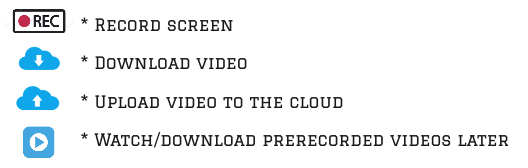
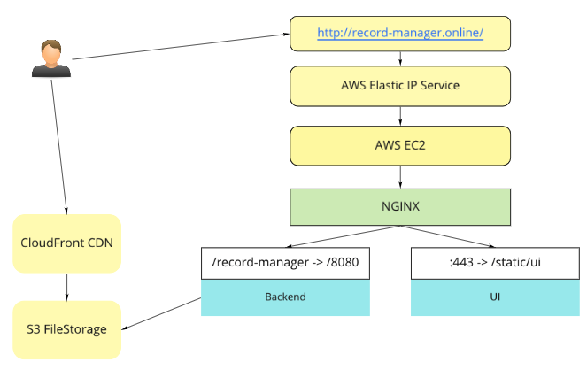

# Simple Screen Recorder
## About
A training project, key goals:
* Research AWS services
* Research WebRTC
* Create a Web-Server application that uses those two
* deploy application
  
Currently, deployed on [GitHub Pages](https://league55.github.io/simple-screen-record/) without back-end.

## Functionality that I was aiming to reach:

## Demo

## Current state:
### TLDR
Only [UI part of application](https://league55.github.io/RTC-screen-record/) is operating: allows recording screen, playing and downloading records in the `webm` format.

### Backend services state
After receiving first bills from AWS for using Elastic IP address I shut down most of what was running on AWS,
and adjusted UI code - added feature switcher so that UI could run it's core feature - screen record, without possibility to upload files to cloud.    
Currently, it is hosted on `GitHub` Pages and deployed from `GitHub Actions` pipeline.

### Limitations
* `Webm` videos scroll is glitching in many video players. AFAIK, it is the limitation of the format. After converting to something like `mp4` it starts working.
* Audio recording is platform / browser dependent. Chrome on Windows records sound fine, while Chrome on OSX can only record sound of a browser tab. More info here.  
* Echo Cancellation and Noise Suppression are also implemented by browser and may not work or even downgrade audio quality sometimes. 

### Tech:
Using technologies that I am already familiar with:
* ReactJS
* Java + Spring Framework

And partially new ones:
* `Semantic UI` instead of `Bootstrapp`
* `S3` storage to store screen recordings
* `AWS Cloudfront` to provide signed urls so that users could download videos directly from AWS without my server as proxy
* `GitHub` actions to build and deploy artifacts

## Challanges & solutions
### Actions taken to provide safety:
* Basic login functionality to give allow users access to only videos that they have created.
* Backend service serves as a proxy to work with files - no AWS links, credentials, bucket names, etc. on UI.
* Used `AWS CloudFront` to give users signed URLs instead of direct `S3` links.

### Actions taken to improve efficiency:
* Only proxy files on upload, use AWS `CloudFront` for download
* `CloudFront` is also a CDN that overall should deliver content faster than just S3.
* Cache some data loaded from AWS:
* List of files
* Signed urls

## Deployment
At one point I deployed and tested whole thing on an AWS EC2 instance, architecture was next: 

